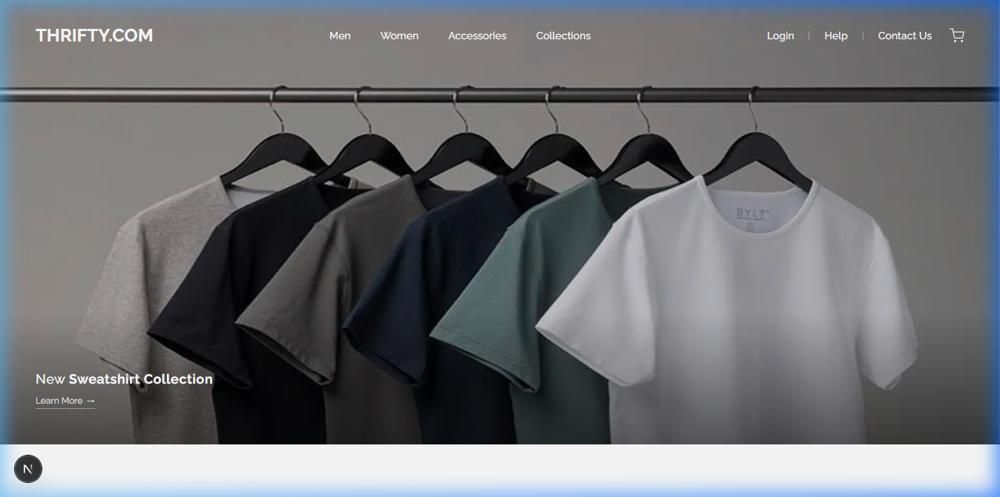

# 👕 Thrifty

> **Elevate your style effortlessly.**

Thrifty is a premium, high-fidelity e-commerce platform for curated streetwear and thrifted apparel. Built with a focus on minimalist aesthetics and high performance, it offers a seamless shopping experience for the modern, conscious consumer.



## ✨ Key Features

- **🎯 Curated Collections**: High-quality streetwear and hand-picked thrifted items.
- **💎 Premium UI**: A sleek, minimalist design featuring glassmorphism and fluid typography.
- **⚡ High Performance**: Optimized image delivery and seamless transitions using Next.js 16.
- **🛒 Streamlined Checkout**: A frictionless, modular checkout flow for maximum conversion.
- **📱 Responsive Design**: First-class experience across all devices, from mobile to desktop.

## 🛠️ Tech Stack


- **Framework**: [Next.js 16](https://nextjs.org/) (App Router)
- **Library**: [React 19](https://react.dev/)
- **Styling**: [Tailwind CSS v4](https://tailwindcss.com/) & CSS Modules
- **Fonts**: [Raleway](https://fonts.google.com/specimen/Raleway) & [Geist](https://vercel.com/font)
- **Icons**: Lucide React

## 🚀 Getting Started

### Prerequisites

- Node.js 18.x or later
- npm or yarn

### Installation

1. Clone the repository:
   ```bash
   git clone https://github.com/[your-username]/thrifty.git
   ```
2. Install dependencies:
   ```bash
   npm install
   ```
3. Create a `.env.local` file and add your configuration (see `.env.example` if available).
4. Start the development server:
   ```bash
   npm run dev
   ```

Open [http://localhost:3000](http://localhost:3000) to view the application.

## 🎨 Design Philosophy

Thrifty follows a "Stealth Dark" and "Minimalist White" aesthetic depending on the collection, utilizing:
- **Fluid Typography**: Using `clamp()` for responsive font sizing.
- **Glassmorphism**: Subtle translucent overlays for a premium feel.
- **Micro-animations**: Smooth transitions and hover states for enhanced engagement.

---

Built with ❤️ by the Thrifty Team.
